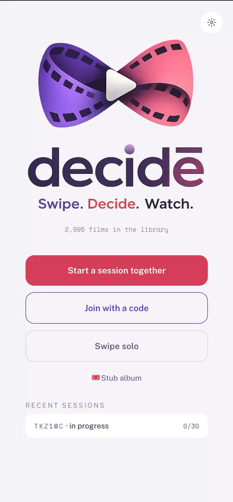
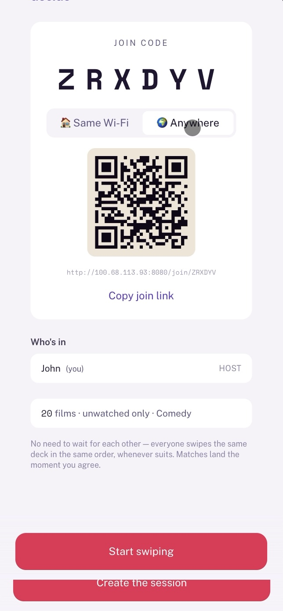
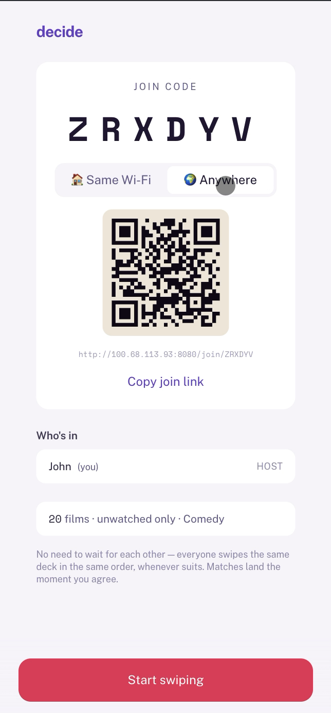
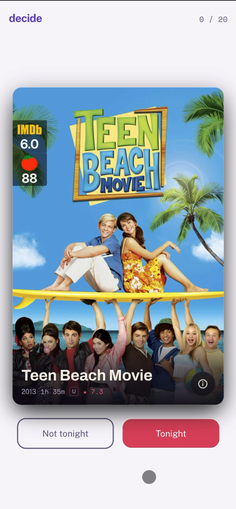
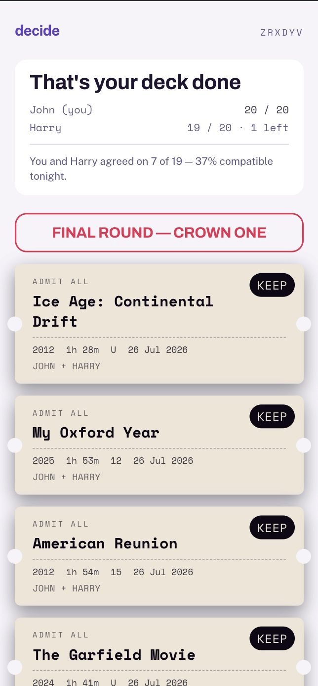

<a id="readme-top"></a>

[![Contributors][contributors-shield]][contributors-url]
[![Forks][forks-shield]][forks-url]
[![Stargazers][stars-shield]][stars-url]
[![Issues][issues-shield]][issues-url]
[![MIT License][license-shield]][license-url]

<br />
<div align="center">
  <a href="https://github.com/hk21x/decide">
    
  </a>

<h3 align="center">decide</h3>

  <p align="center">
    Swipe. Decide. Watch. - a self-hosted swipe-to-match film picker for your Plex library.
    <br />
    <br />
    <a href="https://github.com/hk21x/decide/issues/new?labels=bug">Report Bug</a>
    &middot;
    <a href="https://github.com/hk21x/decide/issues/new?labels=enhancement">Request Feature</a>
  </p>
</div>

<details>
  <summary>Table of Contents</summary>
  <ol>
    <li>
      <a href="#about-the-project">About The Project</a>
      <ul>
        <li><a href="#built-with">Built With</a></li>
      </ul>
    </li>
    <li>
      <a href="#getting-started">Getting Started</a>
      <ul>
        <li><a href="#prerequisites">Prerequisites</a></li>
        <li><a href="#installation">Installation</a></li>
      </ul>
    </li>
    <li><a href="#usage">Usage</a></li>
    <li><a href="#configuration">Configuration</a></li>
    <li><a href="#deployment-notes">Deployment Notes</a></li>
    <li><a href="#roadmap">Roadmap</a></li>
    <li><a href="#development">Development</a></li>
    <li><a href="#contributing">Contributing</a></li>
    <li><a href="#license">License</a></li>
    <li><a href="#contact">Contact</a></li>
    <li><a href="#acknowledgments">Acknowledgments</a></li>
    <li><a href="#disclaimer">Disclaimer</a></li>
  </ol>
</details>

## About The Project

<div align="center">
  
  
  
  
  
  <br />
  <sub>Swipe · start a session · share the code · pick · the Final Round crowns one</sub>
</div>
<br />

Movie night has a deadline, and "what shall we watch?" shouldn't eat half of
it. **decide** turns the choice into a game: two to four people swipe through
the same small deck of films from your Plex library; when everyone says
"Tonight" to the same one, it's a match - and a ticket stub prints.

* **Small decks, not endless scrolling.** Films **or whole series** - filter
  by mood, runtime, rating, certificate, or deal from a Plex collection;
  swipe 20–50 cards, not 3,000.
* **Together or apart.** Everyone swipes the same frozen deck in the same
  order, live on the sofa or hours apart on the train. Matches land the
  moment you agree - with **push alerts** when you're not looking, and
  recent sessions waiting on the Home screen when you come back.
* **It actually decides.** Too many matches? The **Final Round** runs them
  head-to-head until one film is crowned - then open it in Plex, or send it
  straight to the TV.
* **Nights worth keeping.** Every session ends with a taste-compatibility
  score ("You and Dee agreed on 7 of 30 - 23% tonight"), and stubs you keep
  live on in the album long after sessions expire.
* **Private by design.** Your Plex token never leaves the server - every Plex
  call, including artwork, is proxied by the backend. Once synced, it works
  on the LAN with no internet at all.
* **Feels like an app.** Installable PWA with offline swiping that syncs back
  exactly once when the connection returns. Dark and light themes.

decide is an independent project that works with Plex Media Server. It is not
affiliated with or endorsed by Plex, Inc.

<p align="right">(<a href="#readme-top">back to top</a>)</p>

### Built With

* [![React][React.js]][React-url]
* [![TypeScript][TypeScript.badge]][TypeScript-url]
* [![Vite][Vite.badge]][Vite-url]
* [![Tailwind CSS][Tailwind.badge]][Tailwind-url]
* [![Framer Motion][Framer.badge]][Framer-url]
* [![FastAPI][FastAPI.badge]][FastAPI-url]
* [![Python][Python.badge]][Python-url]
* [![SQLite][SQLite.badge]][SQLite-url]
* [![Docker][Docker.badge]][Docker-url]

<p align="right">(<a href="#readme-top">back to top</a>)</p>

## Getting Started

decide runs as a single Docker container alongside your Plex Media Server -
one image, one port, one SQLite file.

### Prerequisites

* Docker (or any OCI runtime) on a machine that can reach your Plex server -
  a Pi, NAS or home server on the same LAN is ideal
* A Plex Media Server with at least one movie library

### Installation

1. Create a `compose.yaml`:

   ```yaml
   services:
     decide:
       image: ghcr.io/hk21x/decide:latest
       container_name: decide
       ports:
         - "8080:8080"
       volumes:
         - ./data:/data
       environment:
         - PUID=1000
         - PGID=1000
       restart: unless-stopped
   ```

2. Start it:

   ```sh
   docker compose up -d
   ```

3. Open `http://<host>:8080` and follow the setup wizard: sign in with Plex
   (a 4-character code at [plex.tv/link](https://plex.tv/link) - decide never
   asks for your password), pick your server and film libraries, and let the
   first sync run.

**Unraid:** a Community Applications template ships in
[hk21x/unraid-templates](https://github.com/hk21x/unraid-templates) - once
accepted you'll find decide in the Apps tab; until then, the template XML
works with Unraid's "Add Container → Template" as well.

<p align="right">(<a href="#readme-top">back to top</a>)</p>

## Usage

1. **Start a session** - pick a mood (or fine-tune genres), a runtime cap, a
   minimum rating, a certificate ceiling for family nights, or a Plex
   collection to deal from. A live counter shows how many films match.
2. **Share the code** - a six-character join code, a copyable link, and a
   **dual QR**: one for people on your Wi-Fi, one for remote friends on your
   Tailscale network (Settings → Access & sharing). Lost your place? Sessions
   reappear on Home, and rejoining never burns one of the four seats.
3. **Swipe** - right means "I'd watch this tonight". Tap ⓘ for the synopsis,
   cast and backdrop. Undo within five seconds if your thumb betrayed you.
4. **Match** - unanimous right-swipes print a ticket stub in the shared
   shortlist, along with how compatible your taste turned out to be tonight.
5. **Crown one** - the **Final Round** puts the matches head-to-head; pass
   the phone, argue, tap winners until one film is crowned for everyone.
   Open it in Plex, or play it on any Plex client the server can see.
6. **Keep the stub** - kept stubs (and crowned winners) go to the 🎟 album,
   a ticket wallet of past movie nights that outlives the sessions.

On iPhone or Android, open the site and **Add to Home Screen** - decide
installs as an app, and swipes made offline sync back when you reconnect.
There's a light theme in Settings if the auditorium look isn't yours.

<p align="right">(<a href="#readme-top">back to top</a>)</p>

## Configuration

Everything is optional - the wizard covers the lot. Env vars exist for
declarative setups:

| Variable | Default | Purpose |
|---|---|---|
| `PORT` | `8080` | Listen port |
| `DATA_DIR` | `/data` | SQLite database + artwork cache |
| `PUID` / `PGID` | `1000` | Run as this user/group |
| `ART_CACHE_MB` | `500` | Artwork disk-cache cap |
| `PLEX_URL` | - | Skip the wizard: server address |
| `PLEX_TOKEN` | - | Skip the wizard: auth token |
| `PLEX_SECTIONS` | - | Comma-separated movie section ids |
| `SECRET_KEY` | auto-generated | Cookie-signing key override |
| `LOCAL_URL` | auto-detected | Join-QR address for the local network |
| `REMOTE_URL` | - | Join-QR address for remote access (e.g. Tailscale) |

<p align="right">(<a href="#readme-top">back to top</a>)</p>

## Deployment Notes

decide uses a WebSocket at `/api/sessions/*/live` - make sure upgrades pass
through your reverse proxy.

**Caddy** (WebSockets work out of the box):

```
decide.example.com {
    reverse_proxy 127.0.0.1:8080
}
```

**nginx**:

```nginx
location / {
    proxy_pass http://127.0.0.1:8080;
    proxy_http_version 1.1;
    proxy_set_header Upgrade $http_upgrade;
    proxy_set_header Connection "upgrade";
    proxy_set_header Host $host;
    proxy_set_header X-Forwarded-For $proxy_add_x_forwarded_for;
}
```

**Remote access** is deliberately out of scope - bring whatever already works
for the rest of your self-hosted stack. [Tailscale](https://tailscale.com/kb/)
is the easiest route if you have nothing yet.

If your Plex server runs in Docker and LAN clients appear as remote
(source-IP NAT), that's a Plex networking quirk, not a decide one - see the
[Plex forum thread on Docker and local network discovery](https://forums.plex.tv/t/plex-docker-container-sees-local-devices-as-remote/124882).

<p align="right">(<a href="#readme-top">back to top</a>)</p>

## Roadmap

- [x] Final Round - head-to-head bracket that crowns tonight's film
- [x] Taste-compatibility stats
- [x] The stub album - kept tickets that outlive sessions
- [x] Decks from Plex collections
- [x] Play the crowned film on a Plex client (TV, etc.)
- [x] Series-level TV decks (swipe whole shows - never episodes)
- [x] Recent sessions + rejoin, match push alerts, Tailscale dual-QR
- [ ] Jellyfin support (media access already sits behind a `MediaSource`
      protocol - a `JellyfinSource` drops in without touching the rest)
- [ ] Per-person Plex sign-in, so "unwatched" means *your* unwatched
- [ ] Save the shortlist to a Plex playlist

See the [open issues](https://github.com/hk21x/decide/issues) for the full
list of proposed features and known issues.

Deliberately **not** planned: video playback (that's Plex's job), TV shows,
more than four people, recommendations, or accounts.

<p align="right">(<a href="#readme-top">back to top</a>)</p>

## Development

No build step magic - a Python backend and a Vite frontend.

Backend (Python 3.12, FastAPI, SQLite - managed with [uv](https://docs.astral.sh/uv/)):

```sh
cd backend
uv sync
DATA_DIR=.dev-data uv run uvicorn decide.main:app --reload --port 8080
uv run pytest
```

Frontend (React 18 + Vite + TypeScript + Tailwind):

```sh
cd frontend
npm install
npm run dev   # proxies /api to :8080
```

Verified Plex endpoint behaviour is documented in
[docs/plex-notes.md](docs/plex-notes.md).

<p align="right">(<a href="#readme-top">back to top</a>)</p>

## Contributing

Contributions are what make the open source community such an amazing place
to learn, inspire, and create. Any contributions you make are **greatly
appreciated**.

If you have a suggestion that would make this better, please fork the repo
and create a pull request. You can also simply open an issue with the tag
"enhancement".

1. Fork the Project
2. Create your Feature Branch (`git checkout -b feature/AmazingFeature`)
3. Commit your Changes (`git commit -m 'Add some AmazingFeature'`)
4. Push to the Branch (`git push origin feature/AmazingFeature`)
5. Open a Pull Request

<p align="right">(<a href="#readme-top">back to top</a>)</p>

## License

Distributed under the MIT License. See `LICENSE` for more information.

<p align="right">(<a href="#readme-top">back to top</a>)</p>

## Contact

Harry - [@hk21x](https://github.com/hk21x)

Project Link: [https://github.com/hk21x/decide](https://github.com/hk21x/decide)

<p align="right">(<a href="#readme-top">back to top</a>)</p>

## Acknowledgments

* [python-plexapi](https://github.com/pkkid/python-plexapi)
* [Fontsource](https://fontsource.org/) (Archivo, Public Sans, Space Mono)
* [Best-README-Template](https://github.com/othneildrew/Best-README-Template)

<p align="right">(<a href="#readme-top">back to top</a>)</p>

## Disclaimer

decide was built with support from AI coding assistants. Every change has
been reviewed by a human and will continue to be, tested thoroughly before
each merge. This project was built for my partner and me, before realising
some of my friends using Plex might benefit from it too. A human (just me,
for now) is always responsible for pulling the trigger on any committed
change, and takes responsibility for any actions.

It's still a one-person hobby project rather than an audited product. By
design, there is no user authentication - anyone who can reach the port can
start a session and browse your library metadata. Run it the way you'd run
any other self-hosted service: on your LAN or behind a tailnet, not exposed
to the internet.

<p align="right">(<a href="#readme-top">back to top</a>)</p>

<!-- MARKDOWN LINKS & IMAGES -->
[contributors-shield]: https://img.shields.io/github/contributors/hk21x/decide.svg?style=for-the-badge
[contributors-url]: https://github.com/hk21x/decide/graphs/contributors
[forks-shield]: https://img.shields.io/github/forks/hk21x/decide.svg?style=for-the-badge
[forks-url]: https://github.com/hk21x/decide/network/members
[stars-shield]: https://img.shields.io/github/stars/hk21x/decide.svg?style=for-the-badge
[stars-url]: https://github.com/hk21x/decide/stargazers
[issues-shield]: https://img.shields.io/github/issues/hk21x/decide.svg?style=for-the-badge
[issues-url]: https://github.com/hk21x/decide/issues
[license-shield]: https://img.shields.io/github/license/hk21x/decide.svg?style=for-the-badge
[license-url]: https://github.com/hk21x/decide/blob/main/LICENSE
[React.js]: https://img.shields.io/badge/React_18-20232A?style=for-the-badge&logo=react&logoColor=61DAFB
[React-url]: https://react.dev/
[TypeScript.badge]: https://img.shields.io/badge/TypeScript-3178C6?style=for-the-badge&logo=typescript&logoColor=white
[TypeScript-url]: https://www.typescriptlang.org/
[Vite.badge]: https://img.shields.io/badge/Vite-646CFF?style=for-the-badge&logo=vite&logoColor=white
[Vite-url]: https://vite.dev/
[Tailwind.badge]: https://img.shields.io/badge/Tailwind_CSS-38B2AC?style=for-the-badge&logo=tailwindcss&logoColor=white
[Tailwind-url]: https://tailwindcss.com/
[Framer.badge]: https://img.shields.io/badge/Framer_Motion-0055FF?style=for-the-badge&logo=framer&logoColor=white
[Framer-url]: https://www.framer.com/motion/
[FastAPI.badge]: https://img.shields.io/badge/FastAPI-009688?style=for-the-badge&logo=fastapi&logoColor=white
[FastAPI-url]: https://fastapi.tiangolo.com/
[Python.badge]: https://img.shields.io/badge/Python_3.12-3776AB?style=for-the-badge&logo=python&logoColor=white
[Python-url]: https://www.python.org/
[SQLite.badge]: https://img.shields.io/badge/SQLite-003B57?style=for-the-badge&logo=sqlite&logoColor=white
[SQLite-url]: https://www.sqlite.org/
[Docker.badge]: https://img.shields.io/badge/Docker-2496ED?style=for-the-badge&logo=docker&logoColor=white
[Docker-url]: https://www.docker.com/
